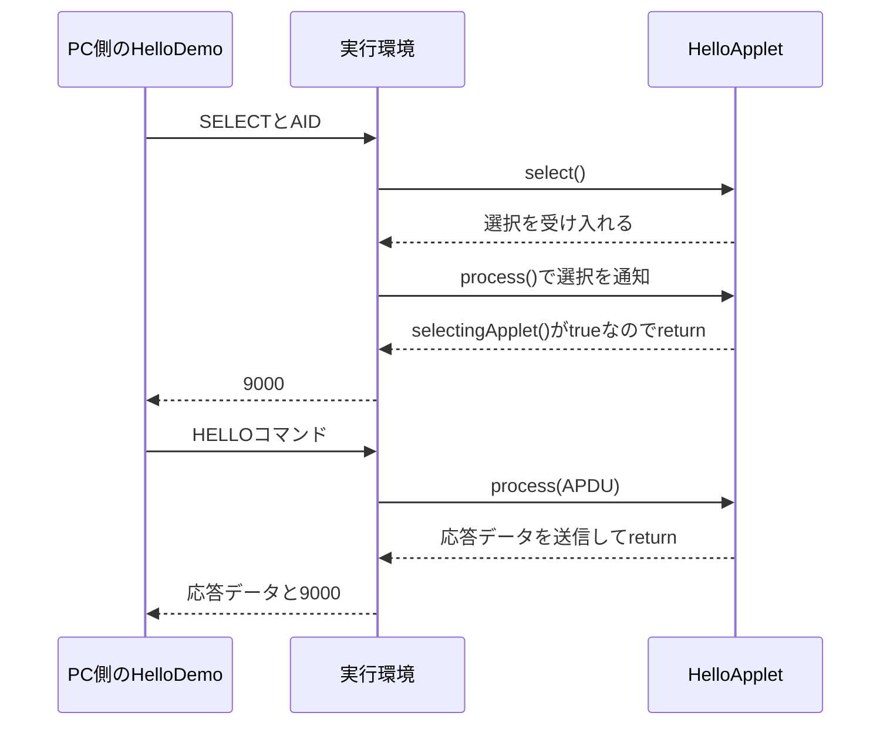

# 第1回：コマンドを送って、応答が返るまで

この回の目標は、**PCから届いた要求に対して、自分のコードがいつ呼ばれ、何を返すのか**を理解することです。
まずREADMEの手順でデモを動かしてください。

## 1. 「Java Card OS」の中で何が動いているか

「Java Card OS」は製品のファームウェア全体を指す場合があります。
設計では、次の役割を区別すると話が整理できます。

| 要素 | 担当すること | この教材との対応 |
| --- | --- | --- |
| PC・端末側アプリ | コマンドを送り、応答やエラーを解釈する | `HelloDemo` |
| アプレット | 製品の機能を実装する。例えば認証やデータの読み書き | `HelloApplet` |
| Java Card実行環境（JCRE） | アプレットの選択・呼び出し、APDUの受け渡しなどを管理する | jCardSimで動作の一部を確かめる |
| Java Card仮想マシン（JCVM）・API | プログラムの実行と、アプレットが呼べる機能を提供する | `Applet`、`APDU`などのAPIを利用する |
| ネイティブ処理・ハードウェア | 通信、物理メモリ、暗号回路などの実装 | 実カードを選んだ段階で確認する |

これは役割の整理で、全要素を独立したソフトウェア層とみなす図ではありません。
Oracleの説明では、Java Card実行環境は仮想マシンとAPIを含みます。
jCardSimはPCのJVMで動くシミュレータなので、実カードのJCVMや物理メモリをそのまま再現したものではありません。
参考：[Oracleのプラットフォーム構成](https://docs.oracle.com/en/java/javacard/3.2/jcdksu/java-card-platform-architecture.html)、[jCardSimの説明](https://github.com/ph4r05/jcardsim#readme)。

GlobalPlatformはアプレットの搭載・管理やセキュリティドメインなどに関係します。
デモの`installApplet()`はシミュレータの準備用APIです。実カードにGlobalPlatformのインストールコマンドを送ったことにはなりません。

## 2. 通常のJavaプログラムと入口が違う

PC側は`main()`から始まります。アプレット側では、実行環境からの呼び出しと、実行環境への登録を使います。

| メソッド | いつ呼ばれるか | 今回の実装 |
| --- | --- | --- |
| `install()` | アプレットをインストールするとき | インスタンスと応答バイト列を作る |
| `register()` | アプレット側から、実行環境へ自身を登録するとき | コンストラクタから呼ぶ |
| `select()` | アプレットが選択されるとき | `Applet`の既定実装を使う |
| `process()` | 選択の通知や、選択後のコマンドを受けるとき | SELECTの通知を判別し、HELLOを処理する |

インストールは毎コマンド行う処理ではありません。
デモは起動するたびに新しいシミュレータを作るため、その都度インストールしています。
参考：[OracleのApplet API](https://docs.oracle.com/en/java/javacard/3.2/jcapi/api_classic/javacard/framework/Applet.html)。

この教材で扱う、単一アプレット・基本論理チャネルでの流れは次のとおりです。



`HelloDemo`は`HelloApplet.process()`を直接呼びません。
コマンドのバイト列をシミュレータに渡し、シミュレータがアプレットへ届けます。
この接点をコードで追うことが、今回の中心です。

## 3. APDUを1バイトずつ読む

APDUは端末とカードがやり取りするコマンド・応答の形式です。
最初に、対象のアプレットをAID（アプリケーション識別子）で選択します。

```text
00 A4 04 00 07 F0 54 55 42 45 01 01
```

| 部分 | 意味 |
| --- | --- |
| `00 A4 04 00` | AIDを指定して選択するSELECTコマンドのヘッダ |
| `07` | 後に続くデータの長さ（Lc、7バイト） |
| `F0 54 55 42 45 01 01` | この教材のアプレットのAID |

このAIDはローカル学習用です。製品で使うAIDを決定したものではありません。

次に送るHELLOは、データ部がなく、応答データを要求する短いAPDU（Case 2S）です。

```text
80 10 00 00 11
```

| バイト | 名前 | 今回の意味 |
| --- | --- | --- |
| `80` | CLA | 教材で定義した独自コマンドのクラス |
| `10` | INS | 教材で定義したHELLO命令 |
| `00` | P1 | 追加パラメータ。今回は0のみ |
| `00` | P2 | 追加パラメータ。今回は0のみ |
| `11` | Le | 受け取れる応答データ長。16進数11＝17バイト |

**このコマンドの5バイト目はLeです。SELECTの5バイト目のLcとは役割が違います。**
APDUの形によって、データ長や応答長が付く位置が変わります。
`Le=00`は短いAPDUでは最大256バイトを意味し、応答不要という意味ではありません。
`CommandAPDU`の引数で256を渡すと、この`00`に変換されます。
参考：[Java SEのCommandAPDU API](https://docs.oracle.com/en/java/javase/17/docs/api/java.smartcardio/javax/smartcardio/CommandAPDU.html)。

返ってくる応答は次の構成です。

| 部分 | 内容 |
| --- | --- |
| 応答データ | ASCIIの`Hello, Java Card!`（17バイト） |
| SW1・SW2 | `90 00`（2バイト、正常終了） |

Leが指定するのはデータの長さです。SWの2バイトは含めません。
`sendBytes()`で送るのもデータ部分だけで、今回の正常終了時は実行環境が`9000`を付けます。

## 4. アプレットの処理を読む

[HelloApplet.java](../src/main/java/io/github/tubesound/javacardbasic/card/HelloApplet.java)を上から読みます。

1. インストール時に、返したい文字をバイト配列にして確保する。
2. `selectingApplet()`でSELECTの通知かどうかを判別する。
3. 実行環境のAPDUバッファからCLA・INS・P1・P2を読む。
4. `setOutgoing()`で応答方向に切り替え、受信側が指定した応答長を取得する。
5. 応答長を設定し、バッファに文字列をコピーして送る。

カード側には`String`や`System.out.println()`を持ち込まず、PC側で文字列に変換して表示しています。
APDUバッファは実行環境の管理下にあるので、アプレットのフィールドに参照を保存しません。
今回は送信だけを扱います。入力データを持つ命令では、`setIncomingAndReceive()`などによる受信処理を先に実装する必要があります。
参考：[OracleのAPDU API](https://docs.oracle.com/en/java/javacard/3.2/jcapi/api_classic/javacard/framework/APDU.html)。

## 5. エラーも通信仕様の一部

| 条件 | 応答SW | 端末側で分かること |
| --- | --- | --- |
| 正常終了 | `9000` | 正常に完了した |
| CLAが80以外 | `6E00` | このアプレットが扱わないコマンドクラス |
| INSが10以外 | `6D00` | このアプレットが扱わない命令 |
| P1またはP2が0以外 | `6A86` | パラメータ指定が違う |
| Leが17未満 | `6C11` | 17バイト分を受け取れる指定が必要 |

上のCLA・INSの判定は、選択済みアプレットに届いた今回の形式のコマンドに対するものです。
SELECTなど実行環境自身が処理する命令もあります。すべてのAPDUが同じ経路でアプレットまで届くわけではありません。

`ISOException.throwIt(...)`は、今回指定したSWで処理を終了させる手段です。
テストではエラー応答に文字列が混ざらないことと、エラー後も次のHELLOが動くことを確認しています。

## 6. 自分で変更して確かめる

**実験A：未対応命令を送る**

`HelloDemo`のHELLO送信でINSを`0x10`から`0x11`に変えます。
`6D00`が表示され、その後デモの正常応答チェックが失敗します。確認したら元に戻します。

**実験B：応答長を変える**

同じ送信の最後の引数を17から16に変えます。
`6C11`が返ります。256にすると送信APDUのLeは`00`になり、文字列と`9000`が返ります。

**実験C：応答を変える**

`HelloApplet`のバイト配列の末尾を`'!'`から`'?'`に変えます。長さは17のままです。
デモの表示が変わり、テストは期待する文字列と違うため失敗します。
仕様として変更するなら、テストと説明も同時に更新します。

## 7. 基本設計に残すこと

| 設計項目 | 第1回で決めたこと | 製品設計で次に確認すること |
| --- | --- | --- |
| 処理の分担 | PCが要求を送り、アプレットが応答する | 製品のどの機能をカード内に置くか |
| 識別方法 | 学習用AIDでアプレットを選択する | 製品用AIDと、複数アプレットの有無 |
| 通信仕様 | 基本チャネル、Case 2SのHELLOとSWを定義 | 入力データ、最大長、実際のT=0/T=1等の通信条件 |
| データ | 固定の応答バイト列をインストール時に確保 | 電源断後に残すデータと、一時データの区別 |
| エラー | 不正なヘッダ・不足するLeをSWで通知 | 再送してよい処理、認証失敗時の状態遷移 |
| 実行基盤 | jCardSimでアプレットの処理を確認 | カード製品、Java Card仕様の版、SDK、GlobalPlatform対応 |

対象製品のカード・OS・SDKはまだ決まった情報として扱っていません。
シミュレータのテストだけでは、CAP変換の可否、物理的な電源断からの復旧、実カードのメモリ制約や分離機構は確認できません。
次回以降、データ受信、永続・一時メモリ、トランザクションの順で、必要な実験を追加します。
