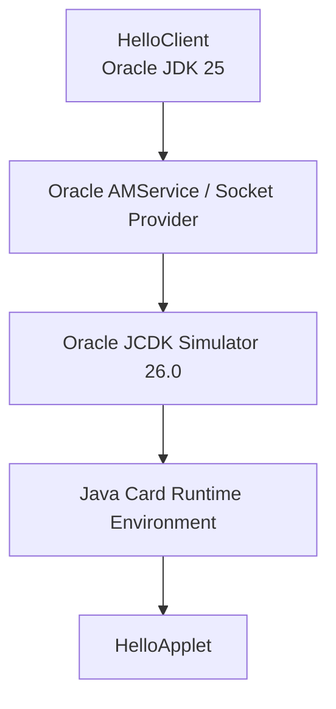

# 第1回: Java Card OSとAPDUをコードで追う

## 1. Java Card OSのどこを作るのか

Java Card搭載製品には、カード製品の実装としてJava Card Virtual Machine、Runtime Environment、API、アプレット管理機能などがあります。
この教材で作るのは、その上で動く`HelloApplet`です。
PC側の`HelloClient`は、Oracle JDK上で動き、Oracle AMServiceとSocket Providerを介してOracle Simulatorへ接続します。



SimulatorはJava Card 3.2の機能動作を確認する参照実行環境です。
実カードの処理速度、メモリ制約、耐タンパー性、電源断、製品固有APIまで保証するものではありません。

## 2. ソースから実行まで

1. Oracle JDKの`javac`が`HelloApplet.java`をJavaクラスへコンパイルする。
2. Oracle JCDK ToolsのConverterがクラスをJava CardのCAPファイルへ変換し、入力と出力を検証する。
3. `HelloClient`がOracle AMServiceを使い、SCP03のセキュアチャネル経由でCAPをSimulatorへロードする。
4. Runtime Environmentがアプレットをインストールし、SELECTされたアプレットへAPDUを配送する。
5. テスト後、`HelloClient`がアプレットとCAPをSimulatorから削除する。

CAPは実カードへ配備する単位です。この工程を通すことで、普通のJavaクラスとして動くだけでは見つからないJava Card言語サブセットや参照の問題も検出できます。

## 3. SELECT APDU

最初に、対象のアプレットをAIDで選択します。

```text
00 A4 04 00 07 F0 54 55 42 45 01 01
```

| 部分 | 意味 |
| --- | --- |
| `00 A4 04 00` | AIDを指定するSELECTコマンドのヘッダ |
| `07` | 後に続くデータ長（Lc） |
| `F0 54 55 42 45 01 01` | 学習用アプレットAID |

SELECTが成功するとRuntime Environmentが`HelloApplet`を選択状態にし、`9000`を返します。
`process()`はSELECT通知でも呼ばれるため、コードでは`selectingApplet()`を確認して戻ります。

## 4. HELLO APDU

次に、データ部がなく応答データを要求する短いAPDU（Case 2S）を送ります。

```text
80 10 00 00 11
```

| バイト | 名前 | 今回の意味 |
| --- | --- | --- |
| `80` | CLA | 教材で定義した独自コマンドクラス |
| `10` | INS | HELLO命令 |
| `00` | P1 | 追加パラメータなし |
| `00` | P2 | 追加パラメータなし |
| `11` | Le | 最大17バイトの応答データを受け取る |

返るデータはASCIIの`Hello, Java Card!`で、後ろに正常終了の`90 00`が付きます。

```text
48 65 6C 6C 6F 2C 20 4A 61 76 61 20 43 61 72 64 21 90 00
```

短いAPDUの`Le=00`は最大256バイトを意味します。
PC側コードでは`new CommandAPDU(..., 256)`が`80 10 00 00 00`へ符号化され、同じ挨拶が返ることも検証します。

## 5. カード側の処理

[HelloApplet.java](../src/applet/java/io/github/tubesound/javacardbasic/card/HelloApplet.java)は次の順に処理します。

1. インストール時に応答用バイト配列を確保し、`register()`する。
2. SELECT通知なら`selectingApplet()`で判別して戻る。
3. APDUバッファからCLA、INS、P1、P2を読む。
4. `setOutgoing()`でPC側が指定したLeを取得する。
5. Leが不足していれば`6C11`を返す。
6. 応答長を設定し、バッファへコピーして送信する。

カード側ではコマンドごとの一時オブジェクト生成を避け、APDUバッファの参照をフィールドへ保存しません。
正常終了の`9000`はRuntime Environmentが追加します。

## 6. ステータスワードも仕様にする

| 条件 | 応答SW |
| --- | --- |
| 正常終了 | `9000` |
| CLAが`80`以外 | `6E00` |
| INSが`10`以外 | `6D00` |
| P1またはP2が0以外 | `6A86` |
| Leが17未満 | `6C11` |

[HelloClient.java](../src/client/java/io/github/tubesound/javacardbasic/client/HelloClient.java)は、この表を実際のOracle Simulatorに対して検証します。
テストフレームワークを介さず、送ったAPDU、受け取ったデータ、SWを表示し、違えばプロセスを失敗させます。

## 7. 自分で変更して確かめる

**実験A: 未対応命令を送る**

`HelloClient`のINSを`0x10`から`0x11`へ変えると`6D00`になります。

**実験B: 応答長を変える**

HELLOのLeを17から16へ変えると`6C11`になります。256なら送信バイトは`Le=00`となり、正常応答になります。

**実験C: 応答を変える**

`HelloApplet`の末尾を`'!'`から`'?'`へ変えます。CAPを再作成するとクライアントの期待値と不一致になり、検証が失敗します。仕様として変える場合は、PC側の期待値と設計資料も同時に更新します。

## 8. 基本設計に残すこと

| 設計項目 | 第1回で決めたこと | 製品設計で次に決めること |
| --- | --- | --- |
| 処理分担 | PCが要求し、アプレットが応答する | 製品機能のうちカード内へ置く範囲 |
| 識別 | 学習用AIDでCAPとアプレットを識別する | 登録済みRIDを含む製品用AID体系 |
| 通信 | 基本チャネル、Case 2SのHELLO | 入力データ、最大長、T=0/T=1などの条件 |
| データ | 固定応答をインストール時に確保する | 永続データ、一時データ、更新単位 |
| エラー | 不正ヘッダと不足LeをSWで通知する | 再送、認証失敗、ロックの状態遷移 |
| 配備 | CAPをSCP03でロードしてインストールする | 実カードのCard Manager、鍵管理、ライフサイクル |
| 実行基盤 | Oracle JCDK Simulator 26.0 | 採用カード、Java Card版、製品固有SDK |

## 公式API

- [APDU](https://docs.oracle.com/en/java/javacard/3.2/jcapi/api_classic/javacard/framework/APDU.html)
- [Applet](https://docs.oracle.com/en/java/javacard/3.2/jcapi/api_classic/javacard/framework/Applet.html)
- [ISO7816](https://docs.oracle.com/en/java/javacard/3.2/jcapi/api_classic/javacard/framework/ISO7816.html)
- [CommandAPDU](https://docs.oracle.com/en/java/javase/25/docs/api/java.smartcardio/javax/smartcardio/CommandAPDU.html)
