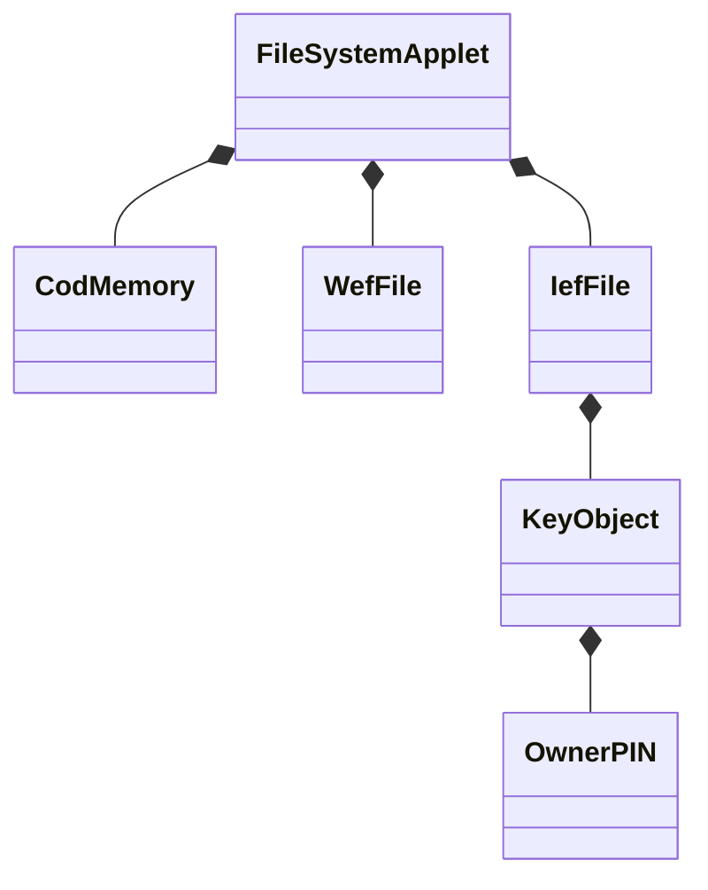

# COD・IEF・WEF・鍵オブジェクト

この章では、JPKI固有のAID、鍵、証明書、コマンドは扱いません。ICカードの基本設計を学ぶため、
このプロジェクト内で次の用語と責務を定義します。

## 用語の位置づけ

| 用語 | このサンプルでの意味 | Java Card上の実装 |
| --- | --- | --- |
| COD | 一時的な作業データを置くtransientメモリ領域 | `CodMemory` が2種類のtransient配列を所有 |
| EF | データまたは内部情報を持つ論理的なElementary File | JavaクラスとしてApplet内に実装 |
| WEF | 通常データを格納するWorking EF | `WefFile` と永続`byte[]` |
| IEF | 鍵などを格納するInternal EF | `IefFile` が`KeyObject`を所有 |
| 鍵オブジェクト | PIN、暗号鍵などの利用規則を隠蔽するオブジェクト | 今回は`KeyObject`が`OwnerPIN`を所有 |

`COD`、`WEF`、`IEF`という名前のクラスはJava Card標準APIにはありません。本サンプルは、設計上の概念を
`javacard.framework`のメモリ機能とJavaオブジェクトへ対応付けたものです。特にCODはこのプロジェクトで
「transientメモリ」と定義した名前です。

## オブジェクト構成



AppletはAPDUを解釈して対象オブジェクトへ処理を委譲します。`WefFile`は鍵の実装を知らず、
`IefFile`は通常データの読出し方法を持ちません。この分離により、後から暗号鍵オブジェクトや
複数ファイルを追加しても責務が混ざりにくくなります。

## サンプルのファイル構成

| FID | 種別 | 初期内容 | アクセス条件 |
| --- | --- | --- | --- |
| `1001` | WEF（透過型） | ASCII `HELLO-WEF` | READは常時可、UPDATEは鍵照合後のみ |
| `1002` | IEF | `KeyObject`（学習用PIN `1234`、3回） | VERIFYのみ。READ BINARYは禁止 |

ファイル選択状態は`CodMemory`の`CLEAR_ON_DESELECT`領域に置きます。そのため、Appletを選択解除すると
FIDは自動的に`0000`へ戻り、再選択後はもう一度EFをSELECTする必要があります。

## APDU一覧

| 操作 | APDU例 | 結果 |
| --- | --- | --- |
| WEF選択 | `00 A4 02 0C 02 10 01` | FID `1001`をCODへ記録 |
| IEF選択 | `00 A4 02 0C 02 10 02` | FID `1002`をCODへ記録 |
| WEF読出し | `00 B0 00 00 09` | `HELLO-WEF 9000` |
| PIN照合 | `00 20 00 80 04 31 32 33 34` | 成功時`9000` |
| WEF更新 | `00 D6 00 00 02 4F 4B` | 先頭2バイトを`OK`へ更新 |
| COD状態取得 | `80 30 00 00 03` | 選択FID 2バイト＋resetカウンター1バイト |
| CODカウンター加算 | `80 31 00 00` | `CLEAR_ON_RESET`領域を加算 |

UPDATEの標準的な流れは次のとおりです。

1. IEF `1002`をSELECTする。
2. VERIFYで鍵オブジェクトを照合する。
3. WEF `1001`をSELECTする。
4. UPDATE BINARYで永続データを更新する。
5. READ BINARYで更新結果を確認する。

PIN照合に失敗すると`63Cx`を返し、`x`は残り試行回数です。未照合のUPDATEは`6982`、EF未選択の
READは`6985`、IEFに対するREAD BINARYは`6986`、存在しないFIDのSELECTは`6A82`です。

## メモリとオブジェクトのライフサイクル

| 対象 | 作成方法 | 選択解除 | リセット／電源断 | 用途 |
| --- | --- | --- | --- | --- |
| `CodMemory`オブジェクト本体 | `new CodMemory()` | 残る | 残る | transient配列への永続参照を保持 |
| 選択FIDの内容 | `CLEAR_ON_DESELECT` | 0クリア | 0クリア | Applet選択中だけ有効な状態 |
| 作業領域・カウンターの内容 | `CLEAR_ON_RESET` | 残る | 0クリア | 同一電源セッションの作業値 |
| `WefFile`と内部`byte[]` | `new` | 残る | 残る | 通常の永続データ |
| `IefFile`、`KeyObject`、PIN値・試行回数 | `new`／`OwnerPIN` | 残る | 残る | 内部情報と認証ポリシー |
| PINの照合済み状態 | `OwnerPIN`内部状態 | `deselect()`で解除 | 解除 | 一時的なセキュリティ状態 |
| `process()`のローカル変数 | メソッド呼出し時 | 該当なし | 該当なし | 呼出し終了までのスタック値 |

重要なのは、`CodMemory`というクラスインスタンス自体がtransientになるわけではないことです。
Java Card Classicで標準的にtransientとして生成できるのは、`JCSystem.makeTransientByteArray()`などで
作る配列です。永続オブジェクトがtransient配列への参照をフィールドとして保持します。

transient配列への更新はトランザクションの対象ではありません。対して、WEFの永続データ更新は
電源断を考慮した原子性が必要です。`WefFile.update()`は`Util.arrayCopy()`を使い、配列コピーを原子的に
扱いますが、複数の永続フィールドを一貫して更新する設計では`JCSystem.beginTransaction()`／
`commitTransaction()`も検討します。

## テストで確認すること

`FileSystemAppletTest`は次を確認します。

- SELECTしたWEFをオフセット指定でREADできる。
- EF未選択、IEF選択中、未知FIDで適切なステータスワードを返す。
- PIN誤りで残り試行回数が減る。
- 未照合ではWEFを更新できない。
- 照合後の更新内容はApplet選択解除後も残る。
- 選択FIDは選択解除で消え、`CLEAR_ON_RESET`カウンターは残る。
- カードリセットでは両方のCOD領域がクリアされる。

```powershell
.\mvnw.cmd -Dtest=FileSystemAppletTest test
```

VS Codeで`codDeselectAndResetAreasHaveDifferentLifetimes()`をDebug Testすると、CODの2種類の寿命を
順番に追えます。`FileSystemApplet.process()`、`CodMemory.selectFile()`、`WefFile.update()`、
`KeyObject.check()`にブレークポイントを置くと、APDUから各オブジェクトへの処理委譲も確認できます。

## 実装上の注意

- `process()`のたびに`new`しません。メモリ断片化と永続メモリ消費を避け、インストール時に確保します。
- IEFの鍵内容をREAD BINARYで返しません。鍵は「値」ではなく「操作」として公開します。
- サンプルPINは学習専用です。実運用ではインストール／パーソナライズ手順で個別設定します。
- 実カードがOSレベルのMF／DF／EF機能を提供する場合、そのベンダーAPIと本サンプルの論理EFは別物です。

## 参考資料

- [Oracle JCSystem API](https://docs.oracle.com/en/java/javacard/3.1/jc_api_srvc/api_classic/javacard/framework/JCSystem.html)
- [Oracle OwnerPIN API](https://docs.oracle.com/en/java/javacard/3.1/jc_api_srvc/api_classic/javacard/framework/OwnerPIN.html)
- [JBMIA「ICカード ファイル設計の手引き」](https://www.jbmia.or.jp/~card/base/contents/uploads/sekkei_tebiki.pdf)

Oracle APIの説明では、通常オブジェクトはCADセッションを越えて保持され、transient配列は電源断時に
データを失い、指定したresetまたはdeselectイベントで既定値に戻ります。JBMIA資料ではEFを通常データ用の
WEFと鍵データ用のIEFに大別しています。
